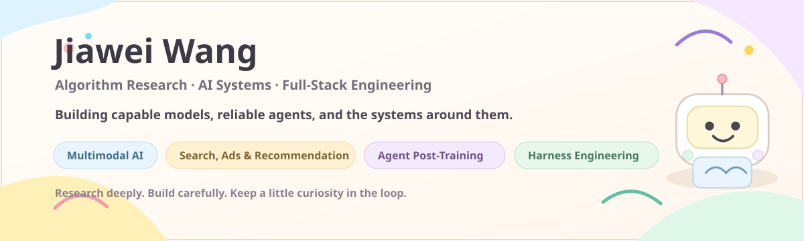

# Hi, I'm Jiawei 👋

### Statistics · Data Science · Applied Mathematics · Artificial Intelligence

**Algorithm Research · AI Systems · Full-Stack Engineering**

I like turning statistical thinking into models, agents, and systems that remain useful outside the notebook.

[GitHub](https://github.com/jiaweine) · [Information Sciences 2026](https://doi.org/10.1016/j.ins.2026.123925)

 

 

## 🌿 About Me

<table>
<tr>
<td width="58%" valign="top">

### 📊 Statistical roots, engineering instincts

My major is **Statistics**, and my interests naturally extend into **Data Science, Applied Mathematics, and Artificial Intelligence**.

I enjoy questions about uncertainty, structure, optimization, representation, and decision-making, but I also care about what happens after the model leaves the experiment: evaluation, runtime behavior, interfaces, tooling, recovery, and deployment.

> **My favorite kind of bug is the one that becomes a research question.**

</td>
<td width="42%" valign="top">

### 🔭 Current technical focus

**🧠 Multimodal AI**  
Representation, reasoning, heterogeneous data

**🔎 Search, Ads & Recommendation**  
Retrieval, ranking, relevance, evaluation

**🧪 Agent Post-Training**  
Trajectories, rewards, preferences, iteration

**🛠️ Harness Engineering**  
Runtime, tools, recovery, verification

</td>
</tr>
</table>

---

## 🧭 Academic Lens

<table>
<tr>
<td width="25%" valign="top">

### 📈 Statistics

Inference, uncertainty, experimental thinking, and models that respect what the data can actually support.

</td>
<td width="25%" valign="top">

### 🧮 Applied Mathematics

Optimization, structure, numerical reasoning, and the mathematical ideas behind learning systems.

</td>
<td width="25%" valign="top">

### 🗂️ Data Science

Data-centric workflows, experimentation, evaluation, and extracting useful signal from messy reality.

</td>
<td width="25%" valign="top">

### 🤖 Artificial Intelligence

Multimodal learning, search and recommendation, agents, post-training, and reliable AI systems.

</td>
</tr>
</table>

---

## 🎯 Current Focus

<table>
<tr>
<td width="50%" valign="top">

### 🧠 Multimodal AI

I am interested in models that learn from heterogeneous signals and reason across modalities rather than treating each input in isolation.

`representation learning` · `multimodal reasoning` · `fusion` · `multimodal agents`

</td>
<td width="50%" valign="top">

### 🔎 Search, Ads & Recommendation

I care about retrieval, ranking, relevance, recommendation quality, and evaluation systems that connect model improvements to real user experience.

`retrieval` · `ranking` · `recommendation` · `evaluation`

</td>
</tr>
<tr>
<td width="50%" valign="top">

### 🧪 Agent Post-Training

I am exploring how trajectories, reward signals, preferences, evaluation, and iteration can systematically improve agent capability.

`trajectory curation` · `reward signals` · `preference optimization` · `agent evaluation`

</td>
<td width="50%" valign="top">

### 🛠️ Harness Engineering

I like building the infrastructure around agents: runtimes, tools, state, checkpoints, verification, recovery, and repeatable evaluation.

`agent runtimes` · `tool orchestration` · `recovery` · `verification`

</td>
</tr>
</table>

---

## 🚀 Selected Work

<table>
<tr>
<td width="50%" valign="top">

### 🧬 [KAMEL](https://github.com/jiaweine/KAMEL)

**KAN-Augmented Multimodal Expert Learning** for heterogeneous and imbalanced tabular data.

Published in **Information Sciences, 2026** and evaluated across **25 benchmark datasets**.

`Multimodal Learning` · `KAN` · `Mixture of Experts` · `PyTorch`

[Repository](https://github.com/jiaweine/KAMEL) · [Paper](https://doi.org/10.1016/j.ins.2026.123925)

</td>
<td width="50%" valign="top">

### 🔎 [Recsys Harness](https://github.com/jiaweine/recsys-harness)

An autonomous workbench for **search and recommendation** diagnosis, experimentation, evaluation, execution, verification, and learning.

Built around evidence, controlled changes, recovery, and repeatable evaluation.

`Search` · `Recommendation` · `Agents` · `Harness Engineering`

[Repository](https://github.com/jiaweine/recsys-harness)

</td>
</tr>
<tr>
<td width="50%" valign="top">

### 🛒 [EcomEvo](https://github.com/jiaweine/EcomEvo-Harness)

A multimodal AI workbench for **business decisions and task execution** with persistent context, visible evidence, human confirmation, and auditable outcomes.

`Multimodal AI` · `Agents` · `Tool Use` · `Full-Stack Engineering`

[Repository](https://github.com/jiaweine/EcomEvo-Harness)

</td>
<td width="50%" valign="top">

### 🎮 [Lingjing · 灵境](https://github.com/jiaweine/lingjing-game-studio)

A controllable and verifiable AI execution workbench for **game development**, designed for multimodal evidence, long-running tasks, recovery, and reliable delivery.

`AI Agents` · `Multimodal` · `Verification` · `Harness Engineering`

[Repository](https://github.com/jiaweine/lingjing-game-studio)

</td>
</tr>
</table>

---

## 🧰 Full-Stack Engineering

<table>
<tr>
<td width="33%" valign="top">

### 🧠 Model & ML

**Python · PyTorch**

Multimodal pipelines  
Training and evaluation  
Data and experiment tooling

</td>
<td width="33%" valign="top">

### ⚙️ Backend & Agent Systems

**FastAPI · APIs**

Data systems  
Agent runtimes  
Tool orchestration and state

</td>
<td width="33%" valign="top">

### 🖥️ Frontend & Infrastructure

**React · TypeScript**

Docker · Linux · Git  
Testing and deployment  
End-to-end system delivery

</td>
</tr>
</table>

---

## ✨ Engineering Principles

### Testable · Traceable · Recoverable · Measurable · Useful

**Smart is not enough.** A good prototype proves an idea. A good system keeps working after the demo ends.

 

### Research deeply. Build carefully. Stay curious.

Algorithms that survive production are more interesting than algorithms that only survive a notebook.

