<div align="center">

<picture>
  <source media="(prefers-color-scheme: dark)" srcset="./assets/profile-hero-dark.svg" />
  <source media="(prefers-color-scheme: light)" srcset="./assets/profile-hero-light.svg" />
  
</picture>

<br/>

**Researcher when the loss converges. Engineer when it doesn't.**

I work across algorithms, agent post-training, evaluation systems, harnesses, and full-stack delivery.

<br/>

[](https://doi.org/10.1016/j.ins.2026.123925)
[](https://www.python.org/)
[](https://pytorch.org/)
[](https://fastapi.tiangolo.com/)

</div>

<br/>

## `01`  Profile

<table>
<tr>
<td width="58%" valign="top">

### I build intelligent systems end to end.

My work sits at the intersection of **algorithm research**, **AI systems**, and **full-stack engineering**.

I care about the full lifecycle: training data, model behavior, post-training, evaluation, runtime control, tool execution, interfaces, failure recovery, and whether the final system is actually useful.

> **My favorite kind of bug is the one that becomes a research question.**

</td>
<td width="42%" valign="top">

### Current signal

```text
SYSTEM      algorithms / agents / full-stack
FOCUS       multimodal / search ads rec
TRAINING    agent post-training
RUNTIME     harness engineering
QUALITY     measurable / recoverable / verifiable
STATUS      shipping
```

</td>
</tr>
</table>

<br/>

## `02`  Research & Engineering Focus

<table>
<tr>
<td width="50%" valign="top">

### ◈ Multimodal AI

Cross-modal representation, reasoning, multimodal agents, heterogeneous data, and applied multimodal systems.

`representation` · `reasoning` · `fusion` · `agents`

</td>
<td width="50%" valign="top">

### ◉ Search · Ads · Recommendation

Retrieval, ranking, recommendation, relevance, quality evaluation, autonomous diagnosis, and optimization.

`retrieval` · `ranking` · `relevance` · `evaluation`

</td>
</tr>
<tr>
<td width="50%" valign="top">

### ◌ Agent Post-Training

Trajectory curation, preference optimization, reward signals, agent evaluation, and iterative capability improvement.

`trajectories` · `preference` · `rewards` · `evaluation`

</td>
<td width="50%" valign="top">

### ◇ Harness Engineering

Evaluation harnesses, agent runtimes, tool orchestration, checkpoints, recovery, verification, and controlled execution.

`runtime` · `tooling` · `recovery` · `verification`

</td>
</tr>
</table>

<br/>

## `03`  Selected Systems

<table>
<tr>
<td width="50%" valign="top">

### 🧬 [KAMEL](https://github.com/jiaweine/KAMEL)

**KAN-Augmented Multimodal Expert Learning** for heterogeneous and imbalanced tabular data.

Published in **Information Sciences, 2026**. Evaluated on **25 benchmark datasets**.

`Multimodal Learning` · `KAN` · `Mixture of Experts` · `PyTorch`

[Repository](https://github.com/jiaweine/KAMEL) · [Paper](https://doi.org/10.1016/j.ins.2026.123925)

</td>
<td width="50%" valign="top">

### 🔎 [Recsys Harness](https://github.com/jiaweine/recsys-harness)

An autonomous workbench for **search and recommendation** diagnosis, experimentation, evaluation, and execution.

Built around evidence, controlled changes, recovery, verification, and real task execution.

`Search` · `Recommendation` · `Agents` · `Harness Engineering`

[Repository](https://github.com/jiaweine/recsys-harness)

</td>
</tr>
<tr>
<td width="50%" valign="top">

### 🛒 [EcomEvo](https://github.com/jiaweine/EcomEvo-Harness)

A multimodal AI workbench for **real business decisions and task execution**.

Persistent context, visible evidence, human confirmation, and auditable outcomes in one full-stack system.

`Multimodal AI` · `Full-Stack` · `Agents` · `Tool Use`

[Repository](https://github.com/jiaweine/EcomEvo-Harness)

</td>
<td width="50%" valign="top">

### 🎮 [Lingjing · 灵境](https://github.com/jiaweine/lingjing-game-studio)

A controllable and verifiable AI execution workbench for **game development**.

Multimodal evidence, recovery, verification, and reliable delivery for long-running tasks.

`AI Agents` · `Multimodal` · `Verification` · `Harness Engineering`

[Repository](https://github.com/jiaweine/lingjing-game-studio)

</td>
</tr>
</table>

<br/>

## `04`  Full-Stack Engineering

<div align="center">


</div>

<br/>

<table>
<tr>
<td width="33%" valign="top">

**Model & Algorithm**

Python · PyTorch · representation learning · ranking · multimodal modeling · agent training

</td>
<td width="33%" valign="top">

**Systems & Backend**

FastAPI · APIs · data pipelines · persistence · evaluation infrastructure · agent runtimes

</td>
<td width="33%" valign="top">

**Interface & Delivery**

React · TypeScript · frontend systems · workflow UX · observability · production integration

</td>
</tr>
</table>

<br/>

## `05`  GitHub Pulse

<div align="center">

<picture>
  <source media="(prefers-color-scheme: dark)" srcset="https://github-readme-activity-graph.vercel.app/graph?username=jiaweine&amp;bg_color=0D1117&amp;color=94A3B8&amp;line=22D3EE&amp;point=A3E635&amp;area=true&amp;area_color=22D3EE&amp;hide_border=true&amp;hide_title=true&amp;radius=16&amp;days=31" />
  <source media="(prefers-color-scheme: light)" srcset="https://github-readme-activity-graph.vercel.app/graph?username=jiaweine&amp;bg_color=FFFFFF&amp;color=64748B&amp;line=0891B2&amp;point=65A30D&amp;area=true&amp;area_color=A5F3FC&amp;hide_border=true&amp;hide_title=true&amp;radius=16&amp;days=31" />
  
</picture>

</div>

<br/>

## `06`  Build Philosophy

<div align="center">

### Smart is not enough.

`testable` · `traceable` · `recoverable` · `measurable` · `useful`

A good prototype proves an idea.  
A good system keeps working after the demo ends.

<br/>

**Research deeply · Build carefully · Ship things that work**

<sub>Algorithms are fun. Algorithms that survive production are even more fun.</sub>

</div>
