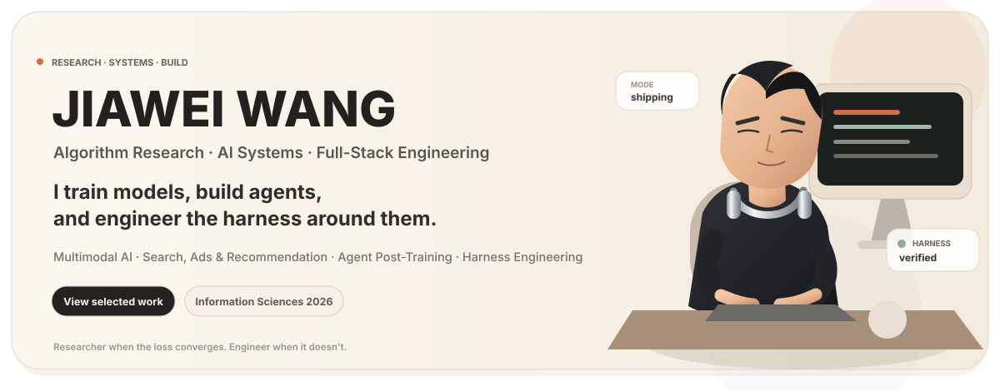

  

  <a href="https://github.com/jiaweine"><b>GitHub</b></a>
  &nbsp;·&nbsp;
  <a href="https://doi.org/10.1016/j.ins.2026.123925"><b>Information Sciences 2026</b></a>

## About

I work where **algorithm research, AI systems, and full-stack engineering** meet. I care about research ideas that survive real data, repeated evaluation, long-running workflows, and production integration.

> **My favorite kind of bug is the one that becomes a research question.**

## Current Focus

<table>
<tr>
<td width="50%" valign="top">
01 · MULTIMODAL AI  
<strong>Representation, reasoning, heterogeneous data</strong>  
Fusion, multimodal agents, and models that connect multiple information sources without losing structure.
</td>
<td width="50%" valign="top">
02 · SEARCH SYSTEMS  
<strong>Search, Ads &amp; Recommendation</strong>  
Retrieval, ranking, recommendation, relevance modeling, evaluation, and autonomous optimization.
</td>
</tr>
<tr>
<td width="50%" valign="top">
03 · AGENT TRAINING  
<strong>Agent Post-Training</strong>  
Trajectory curation, reward signals, preference optimization, agent evaluation, and capability iteration.
</td>
<td width="50%" valign="top">
04 · AGENT SYSTEMS  
<strong>Harness Engineering</strong>  
Evaluation harnesses, agent runtimes, tool orchestration, state, recovery, and verification.
</td>
</tr>
</table>

## Selected Work

<table>
<tr>
<td width="50%" valign="top">
RESEARCH · MULTIMODAL LEARNING  
<h3><a href="https://github.com/jiaweine/KAMEL">KAMEL</a></h3>
KAN-Augmented Multimodal Expert Learning for heterogeneous and imbalanced tabular data.  
Published in <b>Information Sciences, 2026</b> and evaluated across <b>25 benchmark datasets</b>.  
KAN · Mixture of Experts · PyTorch  
<a href="https://github.com/jiaweine/KAMEL">Repository</a> · <a href="https://doi.org/10.1016/j.ins.2026.123925">Paper</a>
</td>
<td width="50%" valign="top">
SEARCH · RECOMMENDATION · AGENTS  
<h3><a href="https://github.com/jiaweine/recsys-harness">Recsys Harness</a></h3>
An autonomous workbench for search and recommendation diagnosis, experimentation, evaluation, and execution.  
Built around evidence, controlled changes, recovery, and repeatable evaluation.  
Search · Recommendation · Harness Engineering  
<a href="https://github.com/jiaweine/recsys-harness">Repository</a>
</td>
</tr>
<tr>
<td width="50%" valign="top">
MULTIMODAL AI · FULL-STACK SYSTEMS  
<h3><a href="https://github.com/jiaweine/EcomEvo-Harness">EcomEvo</a></h3>
A multimodal AI workbench for business decisions and task execution.  
Persistent context, visible evidence, human confirmation, and auditable outcomes.  
Multimodal AI · Agents · Full-Stack Engineering  
<a href="https://github.com/jiaweine/EcomEvo-Harness">Repository</a>
</td>
<td width="50%" valign="top">
AGENTS · VERIFICATION · RUNTIME  
<h3><a href="https://github.com/jiaweine/lingjing-game-studio">Lingjing · 灵境</a></h3>
A controllable and verifiable AI execution workbench for game development.  
Designed for multimodal evidence, long-running tasks, recovery, and reliable delivery.  
AI Agents · Multimodal · Harness Engineering  
<a href="https://github.com/jiaweine/lingjing-game-studio">Repository</a>
</td>
</tr>
</table>

## Full-Stack Engineering

<table>
<tr>
<td width="33%" valign="top">
MODEL  
<strong>Model &amp; ML</strong>  
Python · PyTorch 
Multimodal pipelines 
Training · evaluation
</td>
<td width="33%" valign="top">
RUNTIME  
<strong>Backend &amp; Runtime</strong>  
FastAPI · APIs 
Data systems 
Agent runtimes · tooling
</td>
<td width="33%" valign="top">
DELIVERY  
<strong>Frontend &amp; Infra</strong>  
React · TypeScript 
Docker · Linux · Git 
Testing · deployment
</td>
</tr>
</table>

## Engineering Principles

<table>
<tr><td valign="top">
<h3>Build for the second run, not just the demo.</h3>
<b>Testable · Traceable · Recoverable · Measurable · Useful</b>  
A good prototype proves an idea. A good system keeps working after the demo ends.
</td></tr>
</table>

  <b>Research deeply. Build carefully. Stay curious.</b> 
  Profile UI generated with Java 21 · animated SVG · no runtime dependency 
  <a href="./tools/ProfileUiGenerator.java">View the Java generator</a>

